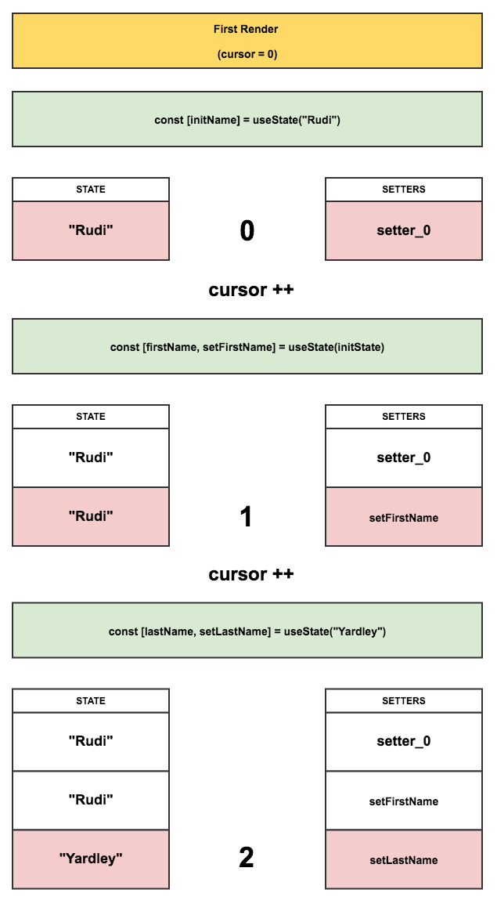

# react_hooks:没有什么 🐂🆚 的，就只是个数组！

---

对于新出来的 hooks API ,我是特别喜欢的，但是它有一些奇怪的限制，在你使用它的时候。在这里，我提出了一个模型，用于考虑如何使用新 API 来解决那些难以理解这些规则的原因的人。


## 探索 hooks 怎么工作的

我听说有些人对于这个新的 hooks API 表示很挣扎，所以我想我会尝试解析至少在表面层面上是如何工作的。

### hooks 的规则

在 hooks 的提案上，官方团队建议我们在使用的时候遵守的两个规则。

- **不要在循环、条件语句、嵌套函数里面调用 hooks**
- **只在 react 函数里面调用 hooks**

后者我认为是不言而喻的。要将行为附加到功能组件，您需要能够以某种方式将该行为与组件相关联。  
然而，我认为前者可能会令人困惑，因为使用这样的 API 进行编程似乎不自然，这就是我今天要探索的内容

### hooks 中的状态管理全都是和数组有关系的

为了更清晰的认识 hooks，让我们看看钩子 API 的简单实现可能是什么样子。  
**请注意，这是推测，只是一种可能的方式来实现 API，来让你认识他。这不一定是 API 在内部的工作方式。**

### 怎么实现`useState()`

让我们在这里分析一个例子来演示状态钩子的实现如何工作。  
首先我们实现一个组件用`useState()`:

```javascript
function RenderFunctionComponent() {
  const [firstName, setFirstName] = useState("Rudi");
  const [lastName, setLastName] = useState("Yardley");

  return <Button onClick={() => setFirstName("Fred")}>Fred</Button>;
}
```

hooks API 背后的想法是你可以使用一个 setter 函数作为钩子函数中的第二个数组项返回，并且 setter 将控制 hooks 管理的状态。

## 那么 react 和它有什么关系呢？

让我们看看这在 React 内部如何工作的。以上内容可在执行上下文中用于呈现特定组件。这意味着此处存储的数据和当前正在呈现的组件不是同一个级别。此状态不与其他组件共享，但它保留在随后呈现特定组件的范围内。

**1) 初始化**  
创建两个空数组`setters`和`state`,设置当前光标为 0。

**2) 第一次渲染**  
第一次运行这个组件。每个`useState()`被调用，push 一个对应的 setter 函数（绑定到光标的位置）到 setters 数组中，把一些状态到`state`数组中。

`第一次渲染：以光标增量写入数组的项。`

**3) 后续渲染**  
每次后续渲染都会重置光标，并且只从每个数组中读取这些值。

`后续渲染：从数组中读取光标增量的项`

**4) 事件处理**  
数组`setters`中每一个 setter 都有一个对应的光标指向到`state`状态数组的 state 值，调用 setter 的方法，就可以改变对应位置的 state 值。


## 一个简单的实现

下列代码是一个原理上简单的实践：

```Javascript
let state = []; //声明存取状态的数组
let setters = [];//声明存取改变状态函数的数组
let cursor = 0;//光标

//setter函数
function createSetter(cursor) {
  return function setterWithCursor(newVal) {
    state[cursor] = newVal;
  };
}

// useState伪代码实现
export function useState(initVal) {
    state.push(initVal);
    setters.push(createSetter(cursor));


  const setter = setters[cursor];
  const value = state[cursor];

  cursor++;
  return [value, setter];
}

// 使用了hooks的组件的代码
function RenderFunctionComponent() {
  const [firstName, setFirstName] = useState("Rudi"); // cursor: 0
  const [lastName, setLastName] = useState("Yardley"); // cursor: 1

  return (
    <div>
      <Button onClick={() => setFirstName("Richard")}>Richard</Button>
      <Button onClick={() => setFirstName("Fred")}>Fred</Button>
    </div>
  );
}


console.log(state); // 渲染之前: []
MyComponent();
console.log(state); // 第一次选择: ['Rudi', 'Yardley']
MyComponent();
console.log(state); // 后续渲染: ['Rudi', 'Yardley']

// 点击了'Fred' 按钮

console.log(state); // 点击之后: ['Fred', 'Yardley']


// 模拟react渲染循环
function MyComponent() {
  cursor = 0; // 重置光标
  return <RenderFunctionComponent />; // 渲染
}
```

## 为什么顺序这么重要

现在，如果我们根据某些外部因素来更改组件状态渲染周期的 hooks 顺序会发生什么？  
来做一些 react 团队不支持的做法：

```javascript
let firstRender = true;

function RenderFunctionComponent() {
  let initName;

  if (firstRender) {
    [initName] = useState("Rudi");
    firstRender = false;
  }
  const [firstName, setFirstName] = useState(initName);
  const [lastName, setLastName] = useState("Yardley");

  return <Button onClick={() => setFirstName("Fred")}>Fred</Button>;
}
```

有一个 useState 调用在条件语句当中，来看一下有什么影响，

**1) 第一次渲染**  

这一次都是正确的，看下第二次

**2) 第二次渲染**  

`firstName`和`lastName`都被设置成了`Rudi`，状态变得不可控了。
这也是为甚 react 官方让我们在使用的时候遵守规范的原因。

## useEffect 伪代码实现

基于上面`useState`的代码，实现 useEffect：

```javascript
function useEffect(callback, depArray) {
  const hasNoDeps = !depArray; //判断是否有数组
  const deps = memoizedState[cursor]; //取出依赖
  const hasChangedDeps = deps
    ? !depArray.every((el, i) => el === deps[i])
    : true; //判断数组是否改变
  if (hasNoDeps || hasChangedDeps) {
    callback(); //执行
    memoizedState[cursor] = depArray; //更新
  }
  cursor++; //更新cursor
}
```

## 总结

在我们的例子中是基于数组大方式实现的，在 react 里面，他的实现类似于单向链表，串联所有的 hook。
